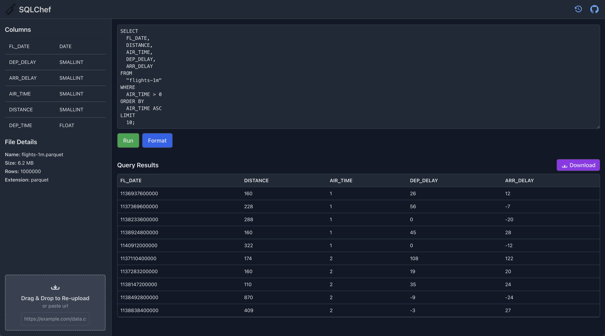

<h3 style="margin: 0; display: flex; align-items: center;">
  <picture>
    <!-- Dark mode logo -->
    <source media="(prefers-color-scheme: dark)" srcset="public/sqlchef-dark.svg">
    <!-- Light mode logo -->
    <source media="(prefers-color-scheme: light)" srcset="public/sqlchef-light.svg">
    <!-- Fallback -->
    
  </picture>
</h3>

**SQLChef** is a powerful, web-based SQL query tool that allows you to effortlessly analyze and manipulate your data. With support for various structured file formats and an intuitive interface, SQLChef makes data querying accessible and efficient for developers, data analysts, and enthusiasts alike.

## Table of Contents

- [Demo](#demo)
- [Features](#features)
- [Installation](#installation)
- [Usage](#usage)
- [Project Structure](#project-structure)
- [Technologies Used](#technologies-used)
- [Contributing](#contributing)
- [License](#license)
- [Acknowledgements](#acknowledgements)

## Features

- **Upload Multiple File Types**: Supports CSV, TSV, TXT, JSON, Parquet, Excel, and SQLite databases.
- **Interactive Query Editor**: Write, format, and execute SQL queries with ease.
- **Query History**: Keep track of your past queries and results for quick reference and restoration.
- **Results Visualization**: View query results in a neatly formatted table with options to download as CSV.
- **Sidebar with File Details**: Inspect uploaded files’ metadata, including columns, data types, and row counts.
- **Drag & Drop & URL Upload**: Easily upload files via drag-and-drop or by pasting a file URL.
- **Local Persistence**: History and last query results are saved in local storage for seamless workflow continuity.
- **Responsive Design**: Optimized for various screen sizes ensuring usability across devices.

## Demo



## Installation

### Prerequisites

- [Node.js](https://nodejs.org/) (v14 or higher)
- [npm](https://www.npmjs.com/) or [yarn](https://yarnpkg.com/)

### Steps

1. **Clone the Repository**

   ```bash
   git clone https://github.com/yourusername/sqlchef.git
   cd sqlchef
   ```

2. **Install Dependencies**

   Using npm:

   ```bash
   npm install
   ```

   Or using yarn:

   ```bash
   yarn install
   ```

3. **Run the Development Server**

   Using npm:

   ```bash
   npm run dev
   ```

   Or using yarn:

   ```bash
   yarn dev
   ```

4. **Build for Production**

   Using npm:

   ```bash
   npm run build
   ```

   Or using yarn:

   ```bash
   yarn build
   ```

5. **Serve the Production Build**

   You can use a static server like `serve` to preview the production build.

   ```bash
   npm install -g serve
   serve -s dist
   ```

   Then navigate to the provided URL to access SQLChef.

## Usage

### Uploading Data

- **Drag & Drop**: Drag your structured file onto the uploader area.
- **File Select**: Click the "Upload File" button to select a file from your device.
- **Paste URL**: Paste a file URL into the designated input field to load remote data.

### Running Queries

1. **Write SQL Query**: Use the query editor to write your SQL statements.
2. **Execute**: Press `Enter` to run the query or `Shift+Enter` to insert a newline.
3. **View Results**: The results will appear in the results section below the editor.
4. **Download**: Click the "Download" button to export results as a CSV file.

### Query History

Access your past queries by clicking the history icon in the header. From the history modal, you can:

- **Restore**: Re-execute a previous query.
- **Clear History**: Remove all past queries from history.

## Project Structure

```
sqlchef/
├── public/
│   └── sqlchef.svg               # Application logo
├── src/
│   ├── components/
│   │   ├── HistoryModal.vue      # Modal for displaying query history
│   │   ├── Interface.vue         # Main interface handling uploads and queries
│   │   ├── Query.vue             # SQL query editor component
│   │   ├── Results.vue           # Component to display query results
│   │   ├── Sidebar.vue           # Sidebar displaying file details
│   │   └── Uploader.vue          # File uploader component
│   ├── services/
│   │   └── duckdbService.js      # Service for interacting with DuckDB
│   ├── App.vue                   # Root Vue component
│   ├── main.js                   # Entry point for the Vue application
│   ├── index.css                 # Tailwind CSS imports
│   └── style.css                 # Custom global styles
├── tailwind.config.js            # Tailwind CSS configuration
├── package.json                  # Project metadata and dependencies
└── README.md                     # Project documentation
```

### Components Overview

- **HistoryModal.vue**: Displays a modal with the user's query history, allowing them to restore or clear past queries.
- **Interface.vue**: Handles file uploads, query execution, and displays results. Integrates with the sidebar and uploader components.
- **Query.vue**: Provides a text area for writing SQL queries with buttons to run or format the query. Shows a loading indicator during query execution.
- **Results.vue**: Presents the results of executed queries in a table format and offers an option to download the results as a CSV file.
- **Sidebar.vue**: Shows detailed information about the uploaded file, including columns, data types, and file metadata. Allows re-uploading of files.
- **Uploader.vue**: Facilitates file uploads through drag-and-drop or by pasting a URL. Handles fetching remote files and emitting selected files for processing.

### Services

- **duckdbService.js**: Manages the initialization and interaction with DuckDB, enabling SQL query execution within the browser.

## Technologies Used

- **[Vue.js](https://vuejs.org/)**: Frontend framework for building interactive user interfaces.
- **[Tailwind CSS](https://tailwindcss.com/)**: Utility-first CSS framework for rapid UI development.
- **[DuckDB](https://duckdb.org/)**: In-browser SQL database for executing queries against uploaded data.
- **JavaScript (ES6+)**: Programming language for application logic.
- **HTML5 & CSS3**: Markup and styling technologies.

## Contributing

Contributions are welcome! Whether it's fixing bugs, improving documentation, or adding new features, your help is appreciated.

1. **Fork the Repository**

   Click the **Fork** button at the top right of this page to create your own copy of the repository.

2. **Clone Your Fork**

   ```bash
   git clone https://github.com/yourusername/sqlchef.git
   cd sqlchef
   ```

3. **Create a New Branch**

   ```bash
   git checkout -b feature/YourFeature
   ```

4. **Make Your Changes**

   Implement your feature or fix the issue.

5. **Commit Your Changes**

   ```bash
   git commit -m "Add some feature"
   ```

6. **Push to Your Fork**

   ```bash
   git push origin feature/YourFeature
   ```

7. **Open a Pull Request**

   Navigate to your fork on GitHub and click the **New Pull Request** button.

## License

This project is licensed under the [MIT License](LICENSE). You are free to use, modify, and distribute it as per the license terms.

## Acknowledgements

- **[DuckDB](https://duckdb.org/)** for providing an efficient in-browser SQL engine.
- **[Tailwind CSS](https://tailwindcss.com/)** for the utility-first CSS framework.
- Inspired by modern SQL tools and data analysis platforms.
- Thanks to the open-source community for their invaluable contributions.
